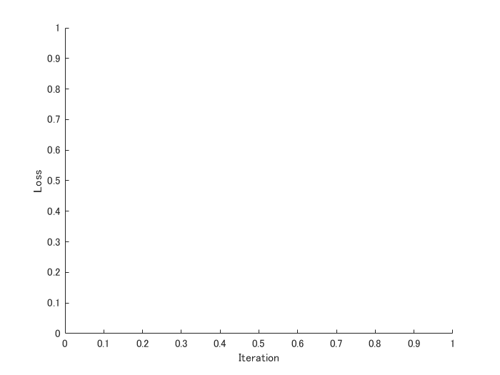

# Data Augmentation using Mix-up with Custom Training Loop


This live script shows how to implement a kind of data augmentation called mix up [1] /sample paring [2].  


Training images are synthesized using a pair of images just like alpha blending.  


According to [1], the `mixup` creates a training image as follows: 


 =    where xi,xj are raw input vectors 


  =   where yi,yj are one-hot label encodings


The classification was done using fine-tuining with a pre-trained network ResNet-18. The Matlab official documents [3-5] were also refferred. 


In this demo, a dataset called Multi-class Weather Dataset for Image Classification [6] was used. The images in the figure above were derived from the dataset [6]. The ratio in the title of each subfigure represents the composition of the classes.  


[1] Zhang, Hongyi, Moustapha Cisse, Yann N. Dauphin, and David Lopez-Paz. "mixup: Beyond empirical risk minimization." *arXiv preprint arXiv:1710.09412* (2017).


[2] Inoue, Hiroshi. "Data augmentation by pairing samples for images classification." *arXiv preprint arXiv:1801.02929* (2018).


This code with custom training loop was made based on the Matlab Official Document located at


[3] Train Network Uing Custom Training Loop: [https://jp.mathworks.com/help/deeplearning/ug/train-network-using-custom-training-loop.html](https://jp.mathworks.com/help/deeplearning/ug/train-network-using-custom-training-loop.html)


[4] Transfer Learning:  [https://jp.mathworks.com/discovery/transfer-learning.html](https://jp.mathworks.com/discovery/transfer-learning.html). 


[5] Transfer Learning Using AlexNet: [https://jp.mathworks.com/help/deeplearning/examples/transfer-learning-using-alexnet.html](https://jp.mathworks.com/help/deeplearning/examples/transfer-learning-using-alexnet.html)


[6] Multi-class Weather Dataset for Image Classification: [https://data.mendeley.com/datasets/4drtyfjtfy/1](https://data.mendeley.com/datasets/4drtyfjtfy/1)


# Load Training Data 


First of all, please down load the data from [6] and unzip into your current directory. Confirm that the folder of dataset2 is in your current directory. Use `imagedatastore` to list up images to use. The images were split into training and validation datset. In your first time to run this code, the images in the dataset2 folder are re-stored into a new folder. Please confirm the folder in the dataset2 after running this section. 


```matlab:Code
clear;clc;close all
cd('dataset2\')
if exist('sunrise')~=7
weather={'cloudy','rain','shine','sunrise'};
for i=1:4
    weather_i=dir([weather{i},'*']);
    weather_i_name={weather_i.name};
    mkdir(weather{i})
    for j=1:numel(weather_i_name)
        I=imread(weather_i_name{j});
        if size(I,3)~=3
        I=I(:,:,1);
        I=cat(3,I,I,I);
        imwrite(I,weather_i_name{j})
        end
    movefile(weather_i_name{j},weather{i})
    end
end
end
cd ../
```

# Image synthesize uisng alpha blending


In this demo, we synthesize training images like alpha blending. Use `imfuse` function and name-value input of 'blend' for alpha blending. Image synthesizing like this will be done in the main section. 


```matlab:Code
I1=imread('car2.jpg');
I2=imread('pears.png');
Iblend=imfuse(I1,imresize(I2,[size(I1,1),size(I1,2)]),'blend');
figure;montage({I1,I2,Iblend});
```


# Store images into datastore and load pre-trained network ResNet-18


We use `imagedatastore` to store the images in the folder dataset2. If you have not download ResNet-18, please down-load it from "add-on".


```matlab:Code
imds = imageDatastore('dataset2','IncludeSubfolders',true, 'LabelSource','foldernames');
netName='resnet18';
% An error is returned if you haven't download resnet-18. 
net=eval(netName);
imgSize=net.Layers(1,1).InputSize;
[imdsTrain,imdsValidation,imdsTest] = splitEachLabel(imds,0.7,0.1,'randomized');
% readAndPreproc is a helper function to resize the input image so that the
% images can be fed into the pre-trained network
% augmentDatastore can replace the helper function. The datastore can
% implement wide variety of data augmentation method
imdsTrain.ReadFcn = @(filename) readAndPreproc(filename,imgSize);
imdsValidation.ReadFcn = @(filename) readAndPreproc(filename,imgSize);
imdsTest.ReadFcn = @(filename) readAndPreproc(filename,imgSize);
% To read all training images into 4D image where each dimension
% corresponds to height, width, RGB channel and number of images.  
XTrainCell=readall(imdsTrain);
% The variable read by readall function is in cell type, then the variable
% was let go went through the function cat to convert into double type.  
XTrain=cat(4,XTrainCell{:});
% Ytrain represents the labels of the training images
YTrain=imdsTrain.Labels;
XValidationCell=readall(imdsValidation);
XValidation=cat(4,XValidationCell{:});
YValidation=imdsValidation.Labels;
XTestCell=readall(imdsTest);
XTest=cat(4,XTestCell{:});
YTest=imdsTest.Labels;
classes = categories(YTrain);
numClasses = numel(classes);
```

# Define Network


Define the network based on the pre-trained network which was loaded in the prior section. 


Create a `dlnetwork` object from the layer graph.


If you run this demo with other pre-trained network, an error will be returned because the layer name to refer should be changed at each pre-trained network. 


```matlab:Code
lgraph = layerGraph(net);
lgraph = replaceLayer(lgraph,'fc1000',fullyConnectedLayer(numClasses, 'Name', 'fc'));
lgraph = removeLayers(lgraph,'prob');
lgraph = removeLayers(lgraph,'ClassificationLayer_predictions');
dlnet = dlnetwork(lgraph);
```

# Define Model Gradients Function


Create the function `modelGradients`, listed at the end of the example, that takes a `dlnetwork` object `dlnet`, a mini-batch of input data `dlX` with corresponding labels `Y` and returns the gradients of the loss with respect to the learnable parameters in `dlnet` and the corresponding loss.


# Specify Training Options


Specify the training options.


```matlab:Code
velocity = [];
numEpochs = 20;
miniBatchSize = 25;
numObservations = numel(YTrain);
numIterationsPerEpoch = floor(numObservations./miniBatchSize);
initialLearnRate = 0.001;
momentum = 0.9;
decay = 0.01;
```


Train on a GPU if one is available. Using a GPU requires Parallel Computing Toolbox™ and a CUDA® enabled NVIDIA® GPU with compute capability 3.0 or higher. You can check if your GPU is qualified for that. 


[https://developer.nvidia.com/cuda-gpus](https://developer.nvidia.com/cuda-gpus)


Note that if your GPU is very brand-new, maybe your Matlab is not ready to use the GPU with this demo.  


```matlab:Code
executionEnvironment = "auto";
```

# Train Model


Create "animatedline" in which the training status is shown.  


```matlab:Code
figure;
lineLossTrain = animatedline('Color','r');
lineLossValid = animatedline('Color','b');
xlabel("Iteration")
ylabel("Loss")
```




# Prepare for validation dataset


To monitor the classification loss with validation data, the validation dataset other than training and test dataset are prepared. For that purpose, `MixUpPreProc` function defined at the end of this script is used. See the supporting function for the detail. 


```matlab:Code
% specify the number of images to mix up
numMixUp = 2;
% Convert XValidation of data to dlarray.
[XValidationMix,YValidationMix,~]=MixUpPreProc(XValidation,YValidation,numMixUp);
dlXValidation= dlarray(single(XValidationMix),'SSCB');
% If training on a GPU, then convert data to gpuArray.
if (executionEnvironment == "auto" && canUseGPU) || executionEnvironment == "gpu"
    dlXValidation = gpuArray(dlXValidation);
end
```

# Synthesizing a new image

   -  The reference [2] says "To synthesize a new image, we take the most naive approach, just averaging the intensity of two images for each pixel".  
   -  This demo shows how to mix up some images to synthesize one image. The number can be specified by the variable `numMixUp`.  
   -  If the number of numMixUp is three, three images were randomly picked from the training dataset and the images were weighted and summed up. For example, consider the weight of α, β, and γ where α + β + γ = 1. The synthesized image I can be represented as follows:  
   -   I = α .* (image A) + β .* (Image B) + γ .* (Image C) 
   -  The number of images to comnine can be control with the variable numMixUp.  


```matlab:Code
iteration = 0;
start = tic;
valFreq = 30;
% Loop over epochs.
for epoch = 1:numEpochs
    [XTrainX,YY,idxS]=MixUpPreProc(XTrain,YTrain,numMixUp);
    % Loop over mini-batches.
    for i = 1:numIterationsPerEpoch
        iteration = iteration + 1;
        
        % Read mini-batch of data and convert the labels to dummy
        % variables.
        idx = (i-1)*miniBatchSize+1:i*miniBatchSize;
        X = XTrainX(:,:,:,idx);
        Y = YY(:,idx);
        
        % Convert mini-batch of data to dlarray.
        dlX = dlarray(single(X),'SSCB');
        
        % If training on a GPU, then convert data to gpuArray.
        if (executionEnvironment == "auto" && canUseGPU) || executionEnvironment == "gpu"
            dlX = gpuArray(dlX);
        end
        
        % Evaluate the model gradients and loss using dlfeval and the
        % modelGradients function.
        [gradients,loss] = dlfeval(@modelGradients,dlnet,dlX,Y);
        [~,lossValid] = dlfeval(@modelGradients,dlnet,dlXValidation,YValidationMix);
        % Determine learning rate for time-based decay learning rate schedule.
        learnRate = initialLearnRate/(1 + decay*iteration);
        
        % Update the network parameters using the SGDM optimizer.
        [dlnet.Learnables, velocity] = sgdmupdate(dlnet.Learnables, gradients, velocity, learnRate, momentum);
        
        % Display the training progress.
        D = duration(0,0,toc(start),'Format','hh:mm:ss');
        addpoints(lineLossTrain,iteration,double(gather(extractdata(loss))))
        if mod(iteration,valFreq)==1
        addpoints(lineLossValid,iteration,double(gather(extractdata(lossValid))))
        legend('training loss','validation loss');hold on
        end
        title("Epoch: " + epoch + ", Elapsed: " + string(D))
        drawnow
    end
end
```


# Test Model


Test the classification accuracy of the model by comparing the predictions on a test set with the true labels.


Convert the data to a `dlarray` object with dimension format `'SSCB'`. For GPU prediction, also convert the data to `gpuArray`.


"`SSCB`" stands for spacial, spacial, channel and batch. 


```matlab:Code
dlXTest = dlarray(single(XTest),'SSCB');
if (executionEnvironment == "auto" && canUseGPU) || executionEnvironment == "gpu"
    dlXTest = gpuArray(dlXTest);
end
```


To classify images using a `dlnetwork` object, use the `predict` function and find the classes with the highest scores.


```matlab:Code
dlYPred = softmax(forward(dlnet,dlXTest));
[~,idx] = max(extractdata(dlYPred),[],1);
YPred  =  classes(idx);
```


Evaluate the classification accuracy.


```matlab:Code
accuracy = mean(YPred==YTest)
```


```text:Output
accuracy = 0.9422
```

# Display the mis-classified images


This section explores the images that were mis-classified in the test dataset. 


```matlab:Code
MisClassificationIdx=find(YPred~=YTest);
% you can specify the number of images to show. if the number of
% mis-classified images was less than that you specified, the number is automatically
% changed
numDisp=min(6,numel(MisClassificationIdx));
IdxShuffled=MisClassificationIdx(randperm(length(MisClassificationIdx)));
figure;
for i=1:numDisp
    subplot(2,3,i)
    imshow(uint8(XTest(:,:,:,IdxShuffled(i))))
    True=string(YTest(IdxShuffled(i)));
    Pred=string(YPred(IdxShuffled(i)));
    title(strcat('True label : ',True,' \newline ','Predicted label :',Pred))
end
```


# Display the synthesized images and its composition ratio

   -  Display the synthesized images and show how much percent a certain image class is used 
   -  The result of `classes` in Line 116 shows the order of each class.  
   -  For example, the result of classes is dog, cat, and bird, the order of the dog class and bird class is 1 and 3, respectively.   
   -  Regarding the composition ratio, if the composition ratio is shown as [0.4 0 0.6], the synthesized images were composed of 40 % of dog image and 60 % of bird image.  
   -  Please confirm this description with this section.  


```matlab:Code
figure;
for j=1:6
i=randi(size(XTrainX,4),[1 1]);
subplot(2,3,j);imshow(uint8(XTrainX(:,:,:,i)))

categoryMix=YTrain(idxS(1,i,1:numMixUp));
IdxMix=find(YY(:,i)~=0);
if numel(IdxMix)==2
title(strcat(string(categoryMix(1)),' : ',num2str(YY(IdxMix(1),i)),' \newline ',string(categoryMix(2)),' : ',num2str(YY(IdxMix(2),i))))
elseif numel(IdxMix)==1
    title(strcat(string(categoryMix(1)),' : ',num2str(1)))
end
end
```


# Model Gradients Function


The `modelGradients` function takes a `dlnetwork` object `dlnet`, a mini-batch of input data `dlX` with corresponding labels `Y` and returns the gradients of the loss with respect to the learnable parameters in `dlnet` and the corresponding loss. To compute the gradients automatically, use the `dlgradient` function.


```matlab:Code
function [gradients,loss] = modelGradients(dlnet,dlX,Y)
% A convolutional operation was done with the function forward 
dlYPred = forward(dlnet,dlX);
% the result obtained was normalized with the function softmax as done in
% softmax layer
dlYPred = softmax(dlYPred);
% cross entropy loss was calculated with the function crossentropy
% if you would like the network to solve a regression problem, squared loss
% is used in many cases
loss = crossentropy(dlYPred,Y);
% the gradiant was calculated with the function dlgradient
gradients = dlgradient(loss,dlnet.Learnables);
end

%This function resizes the images to the proper size for the pre-trained
%network 
function Iout = readAndPreproc(inFilename,imgSize)
    % read the target image
    I = imread(inFilename);
    if size(I,3)==1
        I=cat(3,I,I,I);
    end
    % resize into the input size for the pre-trained model
    Iout = imresize(I,[imgSize(1:2)]);  
end

function [XTrainX,YY,idxS]=MixUpPreProc(XTrain,YTrain,numMixUp)
    % first, the composition ratio of each image was randomly determined
    % for example, in the explanation above, the value of α, β and γ was
    % decided 
    lambda=rand([numel(YTrain),numMixUp]);
    lambda=lambda./sum(lambda,2);%the sum of lambda value accross the class should be 1 
    lambda=reshape(lambda,[1 1 1 numel(YTrain) numMixUp]);
    
    idxS=[]; XTrainK=[]; YTrainK=[]; XTrainX=zeros([size(XTrain)]); 
    numClasses=numel(countcats(YTrain));classes = categories(YTrain);
    % after this loop, idxS will be a vector with the size of (number of
    % training image) * 1 * (number of mix up)
    % number of mixup is, in many cases, 2, but you can specify as you want
    % The value extracted from idxS(N,1,1:end) represents the index of training images to mix up
    % this means, the images with the same class can be mixed up 
    % The images were mixed up with the weight of lamda
    % The variable XTrainX is the images after mixed-up
    for k=1:numMixUp
        idxK=randperm(numel(YTrain));
        idxS=cat(3,idxS,idxK);
        XTrainK=cat(5,XTrainK,double(XTrain(:,:,:,idxK)));
        YTrainK=cat(2,YTrainK,YTrain(idxK)); %YTrainK:(miniBatchSize)×(numMixUp)
        XTrainX=XTrainX+double(XTrain(:,:,:,idxK)).*lambda(1,1,1,:,k);
    end
    
    % Next, the vector which corresponds to the label information was made
    % if the classes in the task are dog, cat and bird and one image was
    % synthesized using 50 % of dog and bird image, 
    % the label for the synthesized image should be [0.5 0 0.5]
    % Howeve, in this loop, the weitht and the classes to pick were
    % randomly collected, then the lables were prepared as follows: 
    lambda=squeeze(lambda);
    Y = zeros(numClasses, numel(YTrain), numMixUp,'single');
    for j=1:numMixUp
        lambdaJ=lambda(:,j);
        for c = 1:numClasses
            Y(c,YTrain(idxS(1,:,j))==classes(c),j) = lambdaJ(find(YTrain(idxS(1,:,j))==classes(c)));
        end
    end
    YY=sum(Y,3);
end
```

